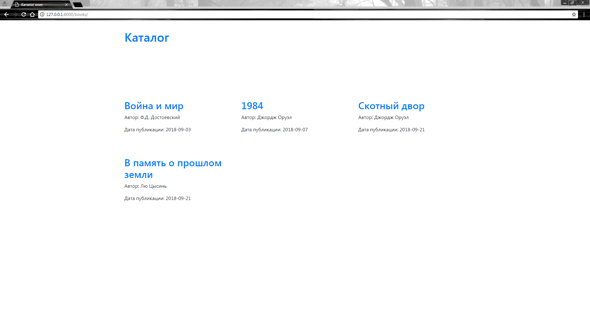
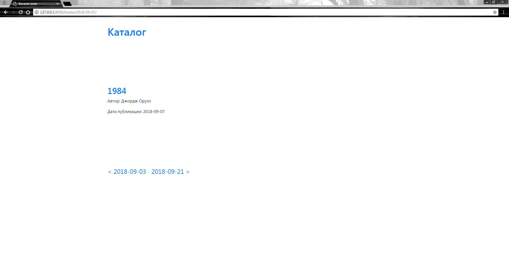

# Алгоритм запуска проекта

1. Установите зависимости:
```bash
pip install -r requirements.txt
```

2. Убедитесь, что в settings.py правильно указаны параметры для подключения к базе данных (БД):
```python
DATABASES = {
    'default': {
        'ENGINE': 'django.db.backends.postgresql',
        'NAME': 'netology_models_list',
        'HOST': 'localhost',
        'PORT': '5432',
        'USER': 'postgres',
        'PASSWORD': 'postgres'
    }
}
```

3. Создайте БД с именем, указанным в NAME (netology_models_list):
```bash
createdb -U postgres netology_models_list
```

4. Осуществите команды для создания миграций приложения с БД:
```bash
python manage.py makemigrations
python manage.py migrate
```

5. Загрузите данные из json в БД:
```bash
python manage.py loaddata fixtures/books.json
```

6. Запустите приложение:
```bash
python manage.py runserver
```

# Текст основного задания ("Делаем онлайн-библиотеку")

## Задание

Необходимо сделать онлайн-библиотеку с каталогом книг. Библиотека должна состоять из двух страниц:

- `/books/` —- отображение списка книг;
- `/books/2021-01-02/` — отображение списка книг за дату 2021-01-02 (год, месяц, день).

Книга имеет три параметра:

- Название,
- Автор,
- Дата публикации (pub_date).

Также на странице `/books/<pub_date>/` сделать возможность пагинации на страницу с книгами предыдущей даты и следующей даты.

Например, в библиотеке имеется 4 книги: одна за пятое число условного месяца, вторая за третье число того же месяца, третья за десятое и последняя за одиннадцатое. На странице `/books/` отображаем все эти книги. А на странице `/books/2021-05-05/` отображаем первую книгу, и ссылки на страницу с книгами за предыдущую дату (2021-05-03) и следующую дату (2021-05-10).

## Ожидаемый результат





## Документация по проекту

Для запуска проекта необходимо

Установить зависимости:

```bash
pip install -r requirements.txt
```

Выполнить следующие команды:

- Команда для создания миграций приложения для базы данных

```bash
python manage.py migrate
```

- Команда для запуска приложения

```bash
python manage.py runserver
```

- Для загрузки начальных данных модели Book необходимо выполнить команду:

```bash
python manage.py loaddata fixtures/books.json
```
